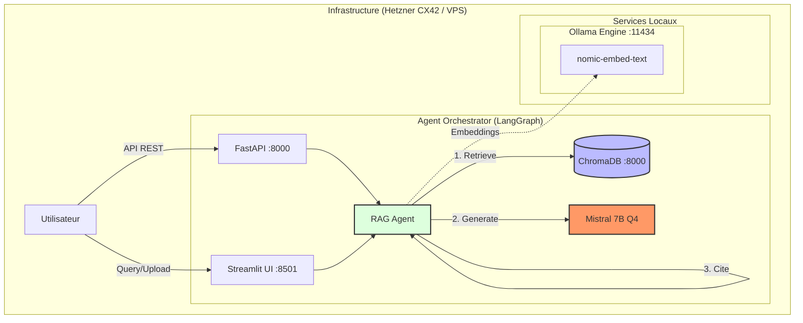

# RAG Local - Chatbot Documentaire 100% Local

Chatbot RAG (Retrieval-Augmented Generation) qui répond aux questions en s'appuyant sur une base documentaire privée. **100% local, zéro données envoyées à l'extérieur, RGPD-compatible.**

## Architecture Visuelle



## Stack Technique

| Composant | Technologie |
|-----------|-------------|
| Orchestration Agent | LangGraph (State Graph) |
| Vector Store | ChromaDB (HNSW L2 Space) |
| LLM Local | Ollama + Mistral 7B (Q4_K_M) |
| Embeddings | nomic-embed-text (768 dims) |
| API | FastAPI |
| UI | Streamlit |
| Infrastructure | Terraform (Hetzner CX42) |

## Déploiement Cloud (Hetzner)

### Phase 1 : Infrastructure (Terraform)

1. **Préparer les accès** : 
   - Récupérez votre API Token Hetzner Cloud.
   - Générez une clé SSH (`ssh-keygen -t ed25519`).
2. **Configurer Terraform** :
   ```bash
   cd terraform/hcloud
   cp terraform.tfvars.example terraform.tfvars
   # Éditer terraform.tfvars avec votre token et votre clé publique
   ```
3. **Déployer le VPS** :
   ```bash
   terraform init
   terraform apply
   ```
   *Terraform va créer l'instance CX42, le Firewall strict et installer Docker via Cloud-Init.*

### Phase 2 : Application (Docker)

1. **Se connecter au serveur** :
   ```bash
   ssh root@<IP_SERVEUR>
   ```
2. **Cloner et lancer** :
   ```bash
   git clone https://github.com/zimomar/rag-chatbot-production.git /app/repo
   cd /app/repo
   cp .env.example .env
   docker compose up -d
   ```
3. **Préparer les modèles (Ollama)** :
   ```bash
   docker exec -it rag-ollama ollama pull mistral:7b-instruct-v0.3-q4_K_M
   docker exec -it rag-ollama ollama pull nomic-embed-text
   ```

## Prérequis
... (rest of the file)
- Docker & Docker Compose v2+
- 16 Go RAM minimum (Mistral 7B Q4 utilise ~6-8 Go)
- 20 Go d'espace disque (modèles Ollama)

## Installation

### 1. Cloner le repository

```bash
git clone https://github.com/your-org/rag-local.git
cd rag-local
```

### 2. Configurer l'environnement

```bash
cp .env.example .env
# Éditer .env si nécessaire
```

### 3. Lancer les services

```bash
docker compose up -d
```

### 4. Télécharger les modèles Ollama

```bash
# Mistral 7B pour la génération
docker exec -it rag-ollama ollama pull mistral:7b-instruct-v0.3-q4_K_M

# nomic-embed-text pour les embeddings
docker exec -it rag-ollama ollama pull nomic-embed-text
```

### 5. Accéder aux interfaces

- **Streamlit UI** : http://localhost:8501
- **FastAPI Docs** : http://localhost:8000/docs
- **ChromaDB** : http://localhost:8001

## Utilisation

### Via l'interface Streamlit

1. Ouvrir http://localhost:8501
2. Uploader vos documents PDF/Markdown dans la sidebar
3. Attendre l'indexation (quelques secondes par document)
4. Poser vos questions dans le chat

### Via l'API

```bash
# Upload d'un document
curl -X POST "http://localhost:8000/upload" \
  -F "file=@document.pdf"

# Poser une question
curl -X POST "http://localhost:8000/query" \
  -H "Content-Type: application/json" \
  -d '{"question": "Quelle est la politique de congés?"}'

# Health check
curl http://localhost:8000/health
```

## Développement

### Installation locale (sans Docker)

```bash
# Créer un environnement virtuel
python -m venv .venv
source .venv/bin/activate  # Linux/Mac
# ou .venv\Scripts\activate  # Windows

# Installer les dépendances
pip install -e ".[dev]"

# Lancer ChromaDB et Ollama séparément
docker compose up chromadb ollama -d

# Lancer l'API
uvicorn src.api.main:app --reload --port 8000

# Lancer Streamlit (autre terminal)
streamlit run src/ui/app.py
```

### Tests

```bash
pytest
pytest --cov=src --cov-report=html
```

### Linting

```bash
ruff check src tests
ruff format src tests
mypy src
```

## Architecture

Voir [ARCHITECTURE.md](ARCHITECTURE.md) pour les détails d'architecture, les flows de données, et les décisions techniques.

## Journal de Développement

Voir [DEVLOG.md](DEVLOG.md) pour l'historique des développements et les prochaines étapes.

## Configuration

| Variable | Description | Défaut |
|----------|-------------|--------|
| `OLLAMA_HOST` | URL du serveur Ollama | `http://ollama:11434` |
| `OLLAMA_MODEL` | Modèle LLM | `mistral:7b-instruct-v0.3-q4_K_M` |
| `OLLAMA_EMBED_MODEL` | Modèle embeddings | `nomic-embed-text` |
| `CHROMA_HOST` | Host ChromaDB | `chromadb` |
| `CHROMA_PORT` | Port ChromaDB | `8000` |
| `CHUNK_SIZE` | Taille des chunks | `1000` |
| `CHUNK_OVERLAP` | Chevauchement chunks | `200` |
| `RETRIEVAL_TOP_K` | Docs récupérés | `4` |

## Limites Connues

- **Pas de GPU** : Inference CPU uniquement (plus lent mais fonctionne)
- **Mistral 7B** : Modèle capable mais pas au niveau GPT-4
- **PDF complexes** : Tableaux et images non extraits
- **Langues** : Optimisé pour le français et l'anglais

## License

MIT
